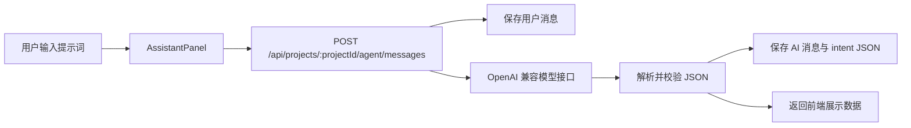

# 开发日志

本文档统一存放项目开发记录。后续开发日志均写入 `docs/DEVELOPMENT_LOG.md`，不再在项目根目录单独维护开发日志文件。

## 2026-05-31 21:30:00 +08:00

### 前端 UI 初始化

- 初始化 MotionWeave AI 的 Next.js 前端界面。
- 新增首页和创作工作台页面。
- 实现两种创作模式：
  - 图片轮播模式。
  - HTML 动画模式。
- 完成工作台基础布局：
  - 项目侧边栏。
  - 中央预览画布。
  - 底部时间线面板。
  - 可拖拽调整宽度的 AI 助手面板。

### 前端结构整理

- 将重复的时间线 UI 抽取到 `TimelinePanel`。
- 简化 `StoryboardTimeline` 和 `HtmlAnimationPanel`，让组件只负责各自模式的数据和新增条目行为。
- 将工作台中文文案整理为 UTF-8 源码文本。
- 通过 `.gitignore` 保持生成目录和依赖目录不进入版本管理。

### 验证结果

- `npm run build` 通过。
- 本地工作台路由可在 `http://127.0.0.1:3001/workspace` 访问。
- 清理 `.next` 并重启开发服务器后，CSS 加载正常。

## 2026-05-31 23:00:00 +08:00

### 工作台工具栏优化

- 将编辑器工具栏中的模式切换替换为更接近生产环境的控制项。
- 新增字幕开关、背景音乐选择器、音量滑块、全屏按钮和导出按钮。
- 将全屏和导出控制固定到工作台工具栏右侧。
- 保持当前项目选择的视频模式作为时间线的唯一状态来源。

## 2026-06-01 15:45:33 +08:00

### Agent 核心工作框架编写指南

目标：实现第一版可用的视频创作 Agent 工作流。用户可以在创作页面右下角与 AI 交流；后端接收用户提示词后，调用 OpenAI 兼容的大模型接口做意图分析；分析结果必须是固定 JSON 格式；聊天内容和 AI 分析结果需要永久化存储。

### 目标链路



### 环境变量要求

在 `.env.local` 和 `.env.example` 中增加：

```env
AI_BASE_URL=https://your-provider.example.com/v1
AI_API_KEY=your_api_key
AI_MODEL=gemini-3-flash-preview
```

规则：

- `AI_MODEL` 缺失时默认使用 `gemini-3-flash-preview`。
- `AI_BASE_URL` 必须支持 OpenAI 兼容的 `/chat/completions` 接口。
- 请求头使用 `Authorization: Bearer ${AI_API_KEY}`。
- 后续切换第三方模型服务时，只修改 `.env` 配置，不改业务代码。

### 数据库存储设计

在 `prisma/schema.prisma` 中增加 Agent 消息持久化结构。

新增枚举：

```prisma
enum AgentMessageRole {
  USER
  ASSISTANT
  SYSTEM
}

enum AgentIntentType {
  GENERATE_OUTLINE
  REGENERATE_OUTLINE
  ADD_SCENE
  DELETE_SCENE
  REGENERATE_SCENE
  OTHER_REJECTED
}
```

在 `Project` 模型中增加关系字段：

```prisma
agentMessages AgentMessage[]
```

新增消息模型：

```prisma
model AgentMessage {
  id         String           @id @default(uuid()) @db.Uuid
  projectId  String           @db.Uuid
  role       AgentMessageRole
  content    String
  intentType AgentIntentType?
  intentJson Json?
  errorJson  Json?
  createdAt  DateTime         @default(now())

  project    Project          @relation(fields: [projectId], references: [id], onDelete: Cascade)

  @@index([projectId, createdAt])
  @@map("agent_messages")
}
```

执行命令：

```bash
npm run db:push
npm run db:generate
```

### 共享 Agent 类型

新增 `src/types/agent.ts`：

```ts
export type AgentIntentType =
  | "GENERATE_OUTLINE"
  | "REGENERATE_OUTLINE"
  | "ADD_SCENE"
  | "DELETE_SCENE"
  | "REGENERATE_SCENE"
  | "OTHER_REJECTED";

export interface AgentIntentResult {
  type: AgentIntentType;
  confidence: number;
  reason: string;
  assistantReply: string;
  payload: {
    outline?: string[];
    insertAfterSceneIndex?: number;
    sceneIndex?: number;
    sceneBrief?: string;
    rejectedReason?: string;
  };
}
```

### 系统提示词设计

新增 `src/lib/agent/prompt.ts`。

要求模型只返回一个合法 JSON 对象，不允许返回 Markdown 包裹，不允许添加解释文本。

```ts
export const AGENT_INTENT_SYSTEM_PROMPT = `
你是视频创作 Agent 的意图分析器。
你只负责分析用户输入，不直接生成最终视频资源。

你必须只返回一个合法 JSON 对象，不能使用 Markdown，不能添加解释文字。

JSON 格式固定如下：
{
  "type": "GENERATE_OUTLINE | REGENERATE_OUTLINE | ADD_SCENE | DELETE_SCENE | REGENERATE_SCENE | OTHER_REJECTED",
  "confidence": 0.0,
  "reason": "你判断该意图的简短原因",
  "assistantReply": "给用户看的简短回复",
  "payload": {
    "outline": ["仅在生成或重新生成大纲时使用"],
    "insertAfterSceneIndex": 1,
    "sceneIndex": 1,
    "sceneBrief": "分镜描述",
    "rejectedReason": "拒绝原因"
  }
}

判断规则：
1. GENERATE_OUTLINE：用户要求从零创建视频结构、故事线、脚本大纲。
2. REGENERATE_OUTLINE：用户要求重做、换一种、重新规划已有大纲。
3. ADD_SCENE：用户明确要求新增镜头、场景、片段；必须尽量判断插入位置。
4. DELETE_SCENE：用户要求删除某个镜头、场景、片段。
5. REGENERATE_SCENE：用户要求重做某个具体分镜。
6. OTHER_REJECTED：和视频创作无关、危险请求、缺少必要上下文且无法判断的内容。
`;
```

### OpenAI 兼容模型客户端

新增 `src/lib/agent/openai-compatible.ts`：

```ts
export async function callIntentModel(messages: { role: "system" | "user"; content: string }[]) {
  const baseUrl = process.env.AI_BASE_URL;
  const apiKey = process.env.AI_API_KEY;
  const model = process.env.AI_MODEL || "gemini-3-flash-preview";

  if (!baseUrl || !apiKey) {
    throw new Error("Missing AI_BASE_URL or AI_API_KEY");
  }

  const response = await fetch(`${baseUrl.replace(/\/$/, "")}/chat/completions`, {
    method: "POST",
    headers: {
      "Content-Type": "application/json",
      Authorization: `Bearer ${apiKey}`,
    },
    body: JSON.stringify({
      model,
      messages,
      temperature: 0.2,
      response_format: { type: "json_object" },
    }),
  });

  if (!response.ok) {
    throw new Error(`AI request failed: ${response.status} ${await response.text()}`);
  }

  const payload = await response.json();
  return payload.choices?.[0]?.message?.content as string | undefined;
}
```

如果第三方服务不支持 `response_format`，先移除该字段，仍然依赖系统提示词和后端 JSON 校验保证输出质量。

### JSON 解析与格式校验

新增 `src/lib/agent/intent-validator.ts`：

```ts
import type { AgentIntentResult, AgentIntentType } from "@/types/agent";

const allowedTypes: AgentIntentType[] = [
  "GENERATE_OUTLINE",
  "REGENERATE_OUTLINE",
  "ADD_SCENE",
  "DELETE_SCENE",
  "REGENERATE_SCENE",
  "OTHER_REJECTED",
];

export function parseAgentJson(raw: string): unknown {
  const cleaned = raw.trim().replace(/^```json\s*/i, "").replace(/^```\s*/i, "").replace(/```$/i, "");
  return JSON.parse(cleaned);
}

export function validateAgentIntent(value: unknown): AgentIntentResult {
  if (!value || typeof value !== "object") {
    throw new Error("Intent result must be an object");
  }

  const item = value as Partial<AgentIntentResult>;

  if (!item.type || !allowedTypes.includes(item.type)) {
    throw new Error("Invalid intent type");
  }

  if (typeof item.confidence !== "number" || item.confidence < 0 || item.confidence > 1) {
    throw new Error("Invalid confidence");
  }

  if (typeof item.reason !== "string") {
    throw new Error("Invalid reason");
  }

  if (typeof item.assistantReply !== "string") {
    throw new Error("Invalid assistantReply");
  }

  if (!item.payload || typeof item.payload !== "object") {
    throw new Error("Invalid payload");
  }

  return item as AgentIntentResult;
}
```

校验失败必须打印错误日志：

```ts
console.error("AI output JSON invalid", { raw, error });
```

### 后端 Agent 消息接口

新增路由：`src/app/api/projects/[projectId]/agent/messages/route.ts`。

接口职责：

- `GET`：读取当前项目的 Agent 聊天历史。
- `POST`：接收用户输入，保存用户消息，调用模型，校验 JSON，保存 AI 消息，返回前端展示数据。

`POST` 流程：

1. 从请求体读取 `content`。
2. 校验 `content` 非空。
3. 加载项目和当前分镜列表。
4. 保存用户消息，`role` 为 `USER`。
5. 将用户提示词、项目信息和分镜上下文发送给模型。
6. 解析并校验模型返回的 JSON。
7. JSON 格式错误时，打印 `AI output JSON invalid`，保存助手错误消息，并返回错误展示数据。
8. JSON 格式正确时，保存助手消息、`intentType` 和 `intentJson`。
9. 返回 `{ userMessage, assistantMessage, intent, display }`。

发送给模型的分镜上下文建议包含：

```ts
const storyboardContext = project.scenes.map((scene) => ({
  index: scene.sceneIndex,
  title: scene.title,
  prompt: scene.prompt,
  narration: scene.narration,
}));
```

模型用户消息建议使用 JSON 字符串：

```ts
{
  userPrompt: content,
  project: {
    id: project.id,
    title: project.title,
    mode: project.mode,
    durationMs: project.durationMs
  },
  storyboard: storyboardContext
}
```

### 前端展示映射

当前阶段只在前端显示分析结果，不直接修改分镜数据。后端返回 `display`，为后续执行逻辑预留接口。

推荐映射：

```ts
function buildAgentDisplay(intent: AgentIntentResult) {
  switch (intent.type) {
    case "GENERATE_OUTLINE":
      return { type: "outline", title: "已分析：生成视频大纲", items: intent.payload.outline ?? [] };
    case "REGENERATE_OUTLINE":
      return { type: "outline", title: "已分析：重新生成视频大纲", items: intent.payload.outline ?? [] };
    case "ADD_SCENE":
      return {
        type: "scene-add",
        title: "已分析：增加一个分镜",
        sceneIndex: intent.payload.insertAfterSceneIndex,
        description: intent.payload.sceneBrief,
      };
    case "DELETE_SCENE":
      return { type: "scene-delete", title: "已分析：删除一个分镜", sceneIndex: intent.payload.sceneIndex };
    case "REGENERATE_SCENE":
      return {
        type: "scene-regenerate",
        title: "已分析：重新生成一个分镜",
        sceneIndex: intent.payload.sceneIndex,
        description: intent.payload.sceneBrief,
      };
    default:
      return {
        type: "rejected",
        title: "无法执行该指令",
        message: intent.payload.rejectedReason ?? intent.assistantReply,
      };
  }
}
```

为后续实际执行预留函数：

```ts
async function executeAgentIntent(projectId: string, intent: AgentIntentResult) {
  switch (intent.type) {
    case "ADD_SCENE":
      // 后续：创建 storyboard scene 和 timeline clip。
      break;
    case "DELETE_SCENE":
      // 后续：软删除分镜并重新平衡时间线。
      break;
  }
}
```

### 前端接入方式

修改 `src/components/workspace/AssistantPanel.tsx`，让组件接收当前项目 ID：

```ts
export function AssistantPanel({ projectId }: { projectId: string }) {}
```

修改 `src/app/workspace/page.tsx`：

```tsx
<AssistantPanel projectId={selectedId} />
```

`AssistantPanel` 中需要完成：

- 使用 `/api/projects/${projectId}/agent/messages` 加载历史消息。
- 发送消息时调用 `POST /api/projects/${projectId}/agent/messages`。
- 将接口返回的 `userMessage` 和 `assistantMessage` 追加到前端消息列表。
- 请求处理中禁用发送按钮。
- 根据 `display.type` 渲染不同助手卡片。

建议前端消息结构：

```ts
interface Message {
  id: string;
  role: "user" | "assistant";
  content: string;
  display?: AgentDisplay;
  createdAt: string;
}
```

展示规则：

- `outline`：显示编号大纲列表。
- `scene-add`：显示插入位置和分镜描述。
- `scene-delete`：显示目标分镜序号。
- `scene-regenerate`：显示目标分镜序号和替换描述。
- `rejected`：显示拒绝原因。
- `error`：显示模型 JSON 格式错误。

### 手动测试提示词

```text
帮我生成一个30秒的赛博朋克产品宣传视频大纲
```

预期类型：`GENERATE_OUTLINE`。

```text
把第2个分镜删掉
```

预期类型：`DELETE_SCENE`。

```text
在第1个分镜后增加一个城市夜景航拍镜头
```

预期类型：`ADD_SCENE`。

```text
重新生成第3个分镜，让它更有科技感
```

预期类型：`REGENERATE_SCENE`。

```text
帮我查询今天股票涨跌
```

预期类型：`OTHER_REJECTED`。

### 验证清单

- `npm run db:push` 执行成功。
- `npm run db:generate` 执行成功。
- `npm run build` 执行成功。
- Agent 聊天历史在页面刷新后仍然存在。
- 模型返回非法 JSON 时，后端打印 `AI output JSON invalid`。
- 缺少 `AI_BASE_URL` 或 `AI_API_KEY` 时，后端返回可控错误。
- 前端能根据不同意图类型显示不同内容。

## 2026-06-01 15:48:24 +08:00

### 开发日志存储位置统一

- 将项目开发日志统一移动到 `docs/DEVELOPMENT_LOG.md`。
- 根目录不再保留单独的 `DEVELOPMENT_LOG.md`。
- 后续所有开发记录均使用中文编写，并在标题中标注具体日期、时间和时区。

## 2026-06-01 16:18:14 +08:00

### 视频脚本与分镜拆分功能实现日志

本次目标：在 Agent 判断用户意图为“生成视频大纲”或“重新生成视频大纲”后，继续调用 AI 生成完整视频逐字稿，并根据逐字稿拆分为多个分镜。每个分镜包含标题、旁白、画面提示词，并根据项目视频模式区分图片轮播提示词和 HTML 动画提示词。

### 本次做了什么

- 扩展 Agent 结构化数据类型，新增 `VideoScriptResult` 与 `VideoScriptScene`。
- 新增视频脚本生成系统提示词，要求 AI 只返回固定 JSON。
- 新增视频脚本 JSON 校验逻辑，校验标题、摘要、模式、完整逐字稿和分镜数组。
- 在 Agent 消息接口中增加二次模型调用：
  - 第一次调用用于判断用户意图。
  - 当意图为 `GENERATE_OUTLINE` 或 `REGENERATE_OUTLINE` 时，第二次调用用于生成完整逐字稿和分镜。
- 将生成的视频脚本结构保存到 `agent_messages.intentJson.payload.generatedScript`。
- 在聊天气泡中只显示部分内容：
  - 视频标题。
  - 摘要。
  - 逐字稿片段。
  - 前 3 个分镜标题。
  - 剩余分镜数量。
- 在聊天气泡下方新增“查看全部并编辑”按钮。
- 新增完整脚本编辑弹窗：
  - 可编辑视频标题。
  - 可编辑摘要。
  - 可编辑完整逐字稿。
  - 可编辑每个分镜标题。
  - 可编辑每个分镜旁白。
  - 可编辑每个分镜画面提示词或动画提示词。
- 在每个分镜卡片内预留按钮：
  - `生成图片`：当前禁用，仅作为后续图片生成入口。
  - `渲染分镜`：当前禁用，仅作为后续画面渲染入口。
- 新增 `PATCH /api/projects/[projectId]/agent/messages`，用于保存用户在弹窗中的修改。
- 保存修改后会回写同一条 AI 消息，使编辑结果本地持久化。

### 本次不做什么

- 不直接生成图片文件。
- 不直接渲染 HTML 动画画面。
- 不直接合成最终视频。
- 不自动覆盖现有 `storyboard_scenes` 表中的分镜数据。
- 不改变现有时间线、素材和导出流程。
- 不新增单独的视频脚本数据库表，当前先复用 `agent_messages.intentJson` 存储结构化脚本，降低迁移复杂度。

### 修改范围

- `src/types/agent.ts`
  - 新增视频脚本和分镜类型。
  - 扩展 `AgentDisplay`，让大纲展示可以携带完整脚本结构。
  - 扩展 `AgentIntentResult.payload`，用于保存 `generatedScript`。

- `src/lib/agent/script-prompt.ts`
  - 新增视频脚本生成提示词。
  - 根据 `slideshow` 与 `html-animation` 生成不同提示词要求。

- `src/lib/agent/script-validator.ts`
  - 新增视频脚本 JSON 校验。
  - 防止 AI 返回空标题、空旁白、空画面提示词或非法模式。

- `src/lib/agent/display.ts`
  - 生成大纲和重新生成大纲时，优先从 `generatedScript.scenes` 构建展示内容。
  - 保留旧 `outline` 字段兼容逻辑。

- `src/app/api/projects/[projectId]/agent/messages/route.ts`
  - 扩展 `POST`：识别生成大纲后继续生成完整逐字稿和分镜。
  - 新增 `PATCH`：保存用户编辑后的脚本与分镜。
  - 保持错误日志输出：
    - 意图 JSON 错误：`AI output JSON invalid`
    - 脚本 JSON 错误：`AI script JSON invalid`

- `src/components/workspace/AssistantPanel.tsx`
  - 扩展聊天气泡的大纲摘要展示。
  - 新增完整脚本编辑弹窗。
  - 新增本地编辑状态和保存逻辑。
  - 保留用户发送后立即显示消息、AI loading 气泡的交互。

### 受影响模块

- Agent 后端接口。
- Agent 消息持久化。
- AI 模型调用链路。
- 工作台右侧 AI 助手面板。
- 聊天气泡展示逻辑。
- 本地持久化的消息 JSON 结构。

### 数据存储说明

- 完整脚本不会单独建表。
- 生成结果保存到 `agent_messages.intentJson.payload.generatedScript`。
- 用户在弹窗中保存修改后，会更新同一条 `agent_messages` 记录。
- 后续如果需要支持版本管理、多人协作或分镜独立状态，可以再拆分为单独的 `video_script_drafts` 或 `generated_storyboards` 表。

### 验证结果

- `npm run build` 执行通过。
- 新增 API 路由类型检查通过。
- 前端弹窗与保存逻辑通过 TypeScript 构建检查。

## 2026-06-01 16:29:33 +08:00

### 分镜详情弹窗时间线化与 Agent 记忆功能

本次目标：优化“查看全部并编辑”弹窗，让分镜以类似底部时间线的方式展示；同时增加 Agent 记忆能力，但只记忆已经被系统研判并结构化保存的内容，不把研判过程本身作为记忆。

### 本次做了什么

- 将脚本详情弹窗中的分镜列表改为时间线式布局。
- 每个分镜以一个可点击方块展示：
  - 分镜序号。
  - 分镜标题。
  - 画面预览占位块。
  - 分镜时长。
  - HTML 动画模式下显示 `HTML` 标记。
- 在分镜方块下方增加时间线连接条：
  - 所有分镜通过横向时间线连接。
  - 当前选中的分镜使用蓝色节点高亮。
  - 支持点击时间线节点切换分镜。
- 将分镜编辑区改为“选中一个分镜后编辑”的模式：
  - 避免一次性展开全部分镜导致弹窗过长。
  - 保留标题、旁白、画面提示词或动画提示词编辑。
  - 保留 `生成图片` 和 `渲染分镜` 预留按钮。
- 增加 Agent 记忆功能：
  - 读取当前项目最近的已验证 Agent 结果。
  - 只使用 `agent_messages.intentJson` 中通过校验的结构化内容。
  - 优先记忆已生成的视频脚本、摘要和分镜内容。
  - 对非拒绝类已执行意图，只记忆最终 payload，不记忆研判原因。
- 将记忆上下文注入：
  - 意图分析调用。
  - 视频脚本生成调用。

### 本次不做什么

- 不记忆用户原始聊天全文。
- 不记忆 AI 对“为什么这样研判”的分析过程。
- 不记忆 `confidence`、`reason` 等研判中间信息。
- 不把失败消息、非法 JSON 或被拒绝任务作为长期记忆。
- 不改变已有分镜数据库表。
- 不把记忆写入单独数据库表，当前记忆来源仍然是已持久化且通过校验的 Agent 消息。

### 修改范围

- `src/components/workspace/AssistantPanel.tsx`
  - 新增分镜时间线展示组件。
  - 弹窗中每个分镜变为方块式时间线节点。
  - 新增当前分镜选择状态。
  - 编辑区只展示当前选中的分镜。

- `src/app/api/projects/[projectId]/agent/messages/route.ts`
  - 新增 `loadAgentMemory`。
  - 从已验证的历史 `intentJson` 中构建 Agent 记忆。
  - 在意图分析与脚本生成时附带记忆上下文。

### 受影响模块

- 工作台右侧 AI 助手面板。
- 视频脚本完整查看与编辑弹窗。
- Agent 后端消息接口。
- AI 意图分析输入上下文。
- AI 视频脚本生成输入上下文。

### 记忆策略说明

- 记忆来源：当前项目内已保存的 `agent_messages.intentJson`。
- 记忆条件：必须能通过 `validateAgentIntent` 校验。
- 记忆内容：
  - 已生成脚本的标题、摘要、分镜标题、旁白、画面提示词。
  - 已接受动作的最终 payload。
- 不记忆内容：
  - 用户原始输入。
  - AI 原始输出。
  - 意图分析 reason。
  - 置信度 confidence。
  - 错误消息。
  - 被拒绝指令。

### 验证结果

- `npm run build` 执行通过。
- Prisma JSON 查询类型检查通过。
- 时间线式弹窗组件通过 TypeScript 构建检查。

## 2026-06-01 16:38:05 +08:00

### 工作区改为使用 Agent 最近生成分镜

本次目标：工作区不再使用项目初始化时写入的占位分镜数据，而是使用 Agent 最近生成并结构化保存的视频脚本分镜。一个项目同一时间只能有一个当前分镜版本；如果 Agent 生成过多个脚本版本，用户可以在工作区自主选择使用哪一个。

### 本次做了什么

- 新增 Agent 生成分镜选择接口：
  - `GET /api/projects/[projectId]/agent/storyboards`
  - `PATCH /api/projects/[projectId]/agent/storyboards`
- 工作区时间线改为读取 `agent_messages.intentJson.payload.generatedScript`。
- 项目当前使用的分镜版本保存到 `Project.metadata.activeGeneratedStoryboardMessageId`。
- 当 Agent 新生成一个脚本与分镜后，该结果会自动成为当前项目 active 分镜。
- 如果项目存在多个 Agent 生成结果，时间线右上角显示下拉选择器，用户可以切换当前使用的分镜版本。
- 时间线中的每个方块现在来自真实生成分镜：
  - 标题来自生成脚本。
  - 旁白来自生成脚本。
  - 画面提示词来自生成脚本。
  - 时长来自生成脚本，缺省为 5 秒。
- 预览区不再只展示固定假内容，会展示当前选中分镜的：
  - 分镜标题。
  - 旁白。
  - 画面提示词摘要。
  - 当前时间和总时长。

### 本次不做什么

- 不再从 `storyboard_scenes` 读取工作区主时间线。
- 不删除历史 Agent 生成版本。
- 不把所有 Agent 生成结果同时塞进一个项目时间线。
- 不自动把 Agent 分镜写入 `storyboard_scenes` 表。
- 不立即生成真实图片、HTML 动画或最终视频。

### 修改范围

- `src/app/api/projects/[projectId]/agent/storyboards/route.ts`
  - 新增生成分镜列表读取和 active 分镜选择接口。
  - 只收集已通过校验且包含 `generatedScript` 的 Agent 消息。

- `src/app/api/projects/[projectId]/agent/messages/route.ts`
  - Agent 新生成脚本后，自动写入 `activeGeneratedStoryboardMessageId`。

- `src/components/workspace/StoryboardTimeline.tsx`
  - 工作区时间线改为读取 Agent 生成分镜。
  - 新增多个生成版本的选择下拉框。
  - 当前选择会持久化到项目 metadata。

- `src/components/workspace/EditorCanvas.tsx`
  - 维护当前选中的 Agent 分镜。
  - 将当前分镜传递给预览区。

- `src/components/common/VideoPreview.tsx`
  - 预览区展示当前真实分镜的标题、旁白和画面提示词。

- `src/components/workspace/TimelinePanel.tsx`
  - 支持传入自定义操作区。
  - 支持隐藏默认新增/调整顺序按钮。

- `src/types/storyboard.ts`
  - 新增 Agent 生成分镜版本类型。

### 受影响模块

- 工作区主预览区。
- 工作区分镜时间线。
- Agent 生成脚本持久化读取。
- 项目 metadata。
- Agent 消息接口。

### 数据策略说明

- 一个项目同一时间只有一个 active 生成分镜版本。
- active 版本通过 `Project.metadata.activeGeneratedStoryboardMessageId` 标识。
- 多个 Agent 生成结果保留在历史消息中，用户可以切换使用。
- 工作区显示内容以 active 版本为准。

### 验证结果

- 首次 `npm run build` 遇到 Next `.next` 缓存中的旧路由产物问题。
- 清理 `.next` 后重新执行 `npm run build` 通过。
- 新路由 `/api/projects/[projectId]/agent/storyboards` 出现在构建输出中。

## 2026-06-01 18:16:53 +08:00

### 交付前浏览器检查规则

新增项目协作规则：每次结束任务之前，需要使用浏览器查看与本次任务相关的功能页面。

### 执行要求

- 如果本次任务涉及前端 UI、页面交互、接口展示或工作区功能，结束前必须打开相关页面进行浏览器检查。
- 如果本次任务只涉及文档，也应优先打开当前工作区或相关功能页，确认项目仍能正常访问。
- 浏览器检查至少确认：
  - 页面可以正常打开。
  - 本次修改涉及的主要入口可见。
  - 没有明显渲染错误或阻塞性前端报错。
- 最终回复中需要说明是否完成浏览器检查，以及检查的页面地址。

### 本次不做什么

- 不要求每次都完整回归所有功能。
- 不要求每次都执行完整端到端测试。
- 不用浏览器检查替代 `npm run build`、接口测试或数据库验证；它只是交付前的页面级确认。

## 2026-06-02

### 项目名称统一为 motionweave-ai

- 当前项目包名保持为 `motionweave-ai`。
- 页面标题、Logo、首页文案、页脚版权和 Agent 入口文档统一使用 `motionweave-ai`。
- 本地目录目标名称为 `D:\aiBeginner\motionweave-ai`。
- GitHub 远端目标仓库名称为 `huiduab/motionweave-ai`。

## 2026-06-03

### 工作区视频播放器与文档整理

- 清理顶部工具栏中重复的音量与全屏控件，让相关操作集中在 `VideoPreview` 播放器内部。
- 删除 `EditorToolbar` / `EditorCanvas` 中已经不再使用的模式切换 prop 链路。
- 将 `.codex-dev-server.log` 加入 `.gitignore`，避免本地开发服务日志进入版本管理。
- 同步整理 `docs/FRONTEND_INDEX.md`，记录字幕切分、气口、播放进度拖动、卡片跳转、音量与全屏等工作区播放器行为。
